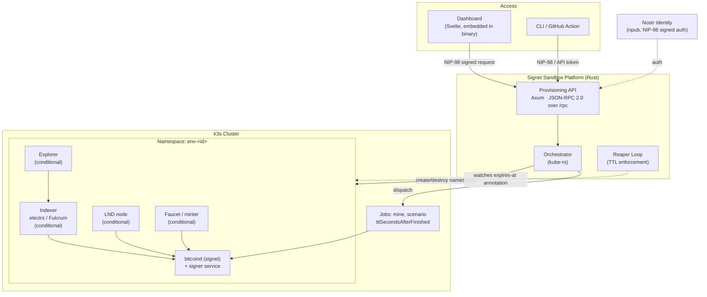

# Signet Sandbox — Technical Specification

**Status:** Draft v0.9 (component version pinning added from implementation)
**Owner:** nully0x
**Implementation started:** 2026-06-12
**Last updated:** 2026-09-03

---

## 1. Problem Statement

Bitcoin companies have no easy way to stand up their own Bitcoin test environment. Regtest is single-node and doesn't exercise real P2P/mempool behavior. Public testnet is shared, unreliable, and faucet-starved. Standing up a private signet correctly (node + signer + indexer + explorer + faucet + optionally Lightning, wired together and kept running) is enough operational work that teams often skip it and integration-test against **mainnet with real funds** instead.

**Signet Sandbox** solves this by giving every team a dedicated, self-configured signet environment — provisioned through a dashboard or API, torn down when they're done, with the same underlying stack available as an open-source self-host deploy.

## 2. Goals

- Every environment is isolated and configured per team — no shared chain to compromise on.
- Configuration is a first-class part of provisioning: teams choose what components they need (explorer, Lightning node, indexer, faucet, block issuance policy) rather than getting a fixed bundle.
- A dashboard is the primary interface — create an environment, pick its configuration, and copy connection details/keys, without needing to know Kubernetes or Docker exists underneath.
- CI usage and long-running team usage are the same primitive, differing only by an optional `ttl`.
- The identical stack is publishable as an OSS self-host template — one product, not a hosted version and a separate public version.

## 3. Non-Goals (v1)

- Not a wallet product. The platform does not custody funds or expose a payments API beyond funding addresses via the faucet.
- Not a key-management or signing service — teams bring/generate their own keys against the endpoints provisioned for them.
- Not attempting mainnet-scale network topology simulation.
- No shared/multi-tenant chain — dropped in favor of isolated-by-default (see §6).

## 4. Personas

| Persona | Need |
|---|---|
| Solo dev / hackathon builder | Fast environment via dashboard, minimal config decisions |
| Vertical engineering team | Fully custom environment — their own signet params, optional LN node, persistent |
| CI pipeline | Same environment type, created with a `ttl`, torn down automatically |
| Infra team wanting full control | Self-hosted OSS deploy of the identical stack |

## 5. Core Concept: Configuration + Connection Bundle

Every environment is created from a **configuration** the team chooses at request time, and returns a **connection bundle** once ready.

**Configuration (request):**
```json
{
  "name": "acme-payments-staging",
  "block_policy": "interval_30s | on_demand",
  "signet_challenge": null,           // null = platform generates one
  "components": {
    "explorer": true,
    "lightning": { "enabled": true, "implementation": "lnd" },  // "ldk_node" planned, not yet supported
    "indexer": true,                  // electrs/Fulcrum — required if explorer or lightning is true
    "faucet": true
  },
  "versions": {                       // optional; absent keys use platform defaults
    "bitcoind": "29.4",
    "lnd": "0.19.2-beta"
  },
  "ttl": null                         // null = always-on; set for CI/ephemeral use
}
```

**Component versions.** Teams pin third-party node versions (`bitcoind`, `electrs`, `explorer`, `lnd`) to reproduce bugs against specific releases. Values are **image tags only** — the platform owns the registry/repo mapping, so arbitrary image injection is impossible. The signer and faucet are platform components and are never user-versioned. Versions are fixed at creation (changing them mid-life is rejected rather than migrating a running chain), and the resolved image map is echoed in the connection bundle so CI runs can record exactly what they tested against.

**Connection bundle (response):**
```json
{
  "environment_id": "env_9f2a...",
  "status": "provisioning | ready | expired | destroyed",
  "rpc_url": "https://sandbox.signet.dev/env/9f2a/rpc",
  "rpc_auth": "...",
  "zmq_url": "tcp://sandbox.signet.dev:28332",
  "indexer_url": "https://sandbox.signet.dev/env/9f2a/electrs",
  "explorer_url": "https://sandbox.signet.dev/env/9f2a/explorer",
  "faucet_url": "https://sandbox.signet.dev/env/9f2a/faucet",
  "lightning": {
    "implementation": "lnd",
    "rest_url": "https://sandbox.signet.dev/env/9f2a/ln/rest",
    "macaroon_or_rune": "..."
  },
  "signet_challenge": "512103...ae",
  "block_policy": "interval_30s",
  "versions": { "bitcoind": "bitcoin/bitcoin:29.4", "signer": "signet-signer:dev" },
  "expires_at": null
}
```

Fields for disabled components (`lightning`, `explorer`, `indexer`, `faucet`) are simply omitted from the bundle — the dashboard and API surface only what was actually provisioned.

## 6. Deployment Model

The shared, multi-tenant chain from earlier drafts is dropped — per-team customization (own signet params, optional Lightning node, optional explorer) can't coexist with a chain other tenants also depend on. Every environment is isolated by default; the only variable is lifetime.

| Mode | What happens on request | Lifetime |
|---|---|---|
| **Team environment** | Full config-driven stack provisioned on platform infra | `ttl` omitted — always-on until explicitly destroyed |
| **CI / ephemeral** | Identical provisioning path, same config options | `ttl` set on creation — auto-destroyed when it elapses |
| **Self-hosted (OSS)** | User deploys the same template on their own infra | Whatever the user wants |

"CI" is a lifetime setting, not a separate tier or code path — one provisioning flow serves both.

## 7. Architecture Overview



The Provisioning API is the single entry point for both the Dashboard and the CLI — neither talks to Kubernetes directly. The Orchestrator is the only component that creates or destroys cluster resources; the Reaper Loop only reads (`expires-at`) and deletes, on the same namespace boundary the Orchestrator created.

## 8. Dashboard (primary interface)

The dashboard is how most users interact with Signet Sandbox day-to-day; the API exists for CI and programmatic access, not as the primary UX.

- **Create environment**: form-driven version of the configuration object in §5 — name, block policy, which components to include, optional TTL.
- **Environment detail view**: live status, connection bundle rendered as copyable fields (RPC URL + credentials, indexer URL, explorer link opens inline, faucet action, LN node REST endpoint + macaroon/rune if Lightning is enabled).
- **Lifecycle actions**: reset, destroy, extend/clear TTL — dashboard buttons wrapping the same Provisioning API calls the CLI uses. Snapshot/restore deferred (see §9 rationale) — added here once built.
- **Scenario controls**: reorg/stuck-fee/RBF triggers exposed as dashboard actions, scoped to the team's own environment — safe by construction now, since there's no shared-chain blast radius to worry about.
- **API token / key management**: since environments are isolated per team, this is also where a team generates the credentials their CI pipeline or app backend will authenticate with.

## 9. Provisioning API

**Transport: JSON-RPC 2.0** over a single HTTP endpoint (`POST /rpc`), not REST. This keeps the provisioning layer consistent with bitcoind's own RPC style, which the environments it manages already speak — one calling convention across the whole platform instead of REST-for-provisioning / JSON-RPC-for-the-node.

Authenticated via NIP-98 (signed Nostr event as bearer token on the HTTP request); a long-lived API token can be issued after first auth for CI use where a signing step per request isn't practical.

**Request shape:**
```json
{
  "jsonrpc": "2.0",
  "id": "1",
  "method": "environment.create",
  "params": { "...": "configuration object from §5" }
}
```

**Methods:**

| Method | Params | Purpose |
|---|---|---|
| `environment.create` | configuration object (§5) | Create environment. Returns connection bundle. |
| `environment.get` | `{ id }` | Fetch current connection bundle / status. |
| `environment.update` | `{ id, ttl?, components? }` | Update TTL (extend/clear) or add a component (subject to feasibility — see §12). |
| `environment.reset` | `{ id }` | Reset chain state to genesis/funded-baseline. |
| `environment.snapshot` *(deferred)* | `{ id }` | Capture current chain/UTXO state. Not in v1 — see rationale below. |
| `environment.restore` *(deferred)* | `{ id, snapshot_id }` | Restore to a prior snapshot. Not in v1 — see rationale below. |
| `environment.destroy` | `{ id }` | Tear down. |
| `environment.faucet` | `{ id, address, amount_sat }` | Mint sats to a given address (only valid if `faucet: true`). |
| `environment.mine` | `{ id, blocks }` | Mine N blocks (on-demand block policy only). |
| `environment.scenario` | `{ id, type: "reorg" \| "stuck_fee" \| "rbf", params }` | Trigger a scenario, scoped entirely to this environment. |

Errors follow standard JSON-RPC 2.0 error objects (`code`, `message`, optional `data`) rather than HTTP status codes carrying the failure semantics — the HTTP layer is just a transport, request/response status lives in the JSON-RPC envelope.

**Why snapshot/restore are deferred, not core v1:** `environment.reset` already covers the common case — wipe an environment back to a clean, funded baseline between test runs, which is what most teams need day to day. Snapshot/restore earns its keep only for a narrower case: a team has spent real setup time building a specific fixture state (several funded addresses, an established channel, a particular transaction history) and wants to capture that exact state once, then restore to it repeatedly — for CI reproducibility, for branching two different test scenarios from the same starting point, or for freezing state right before a bug to investigate later. That's a real need, but it's also real implementation cost (chain/UTXO state capture, a storage backend, restore correctness) for a feature only some teams will use. Reasonable to build it once there's a concrete team asking for it rather than speculatively in v1 — `reset` ships now, `snapshot`/`restore` are designed (method shape above, `Snapshot` entity in §13) but not built until there's a real use case pulling them forward.

## 10. CLI / CI Tooling

```
signet up --config ./sandbox.json --ttl 20m   # provisions from a config file, prints connection bundle
signet fund <address> --amount 500000
signet mine 6
signet scenario reorg --depth 2
signet down
```

Config file mirrors the JSON object in §5, so the same file a developer used to create their persistent dashboard environment can be reused verbatim in CI with `--ttl` appended. Packaged as a small CLI plus a GitHub Action wrapping the Provisioning API — no orchestration logic in the CI script itself.

## 11. Infra Templates

One template definition per component, composed based on the requested configuration:

- **Core (always present)**: bitcoind (signet mode, generated or supplied challenge) + signer service.
- **Indexer (conditional)**: electrs or Fulcrum — auto-included if `explorer` or `lightning` is requested, since both depend on it.
- **Explorer (conditional)**: self-hosted mempool.space instance or btc-rpc-explorer.
- **Lightning**: LND at launch, connected to the environment's bitcoind, exposing its native REST/gRPC endpoint and auth (macaroon) in the connection bundle. A second implementation is planned — **ldk-node** rather than full CLN, since it's the lighter-weight, embeddable option that better matches how many of the target verticals are actually building their own Lightning apps (vs. running general-purpose node software).
- **Faucet (conditional)**: minter service, since the platform controls the coinbase.
- **Block policy** is a parameter on the core component, not a separate one: `interval_30s` for demo-like determinism, `on_demand` for CI environments using `/mine` explicitly.

Published as:
- `docker-compose.yml` (with profiles per component) — the OSS one-click self-host artifact.
- `helm/` chart, componentized the same way, for platform-run provisioning.

## 12. Deployment & Orchestration

Runtime target: **k3s**. The provisioning API's orchestrator talks to the cluster via `kube-rs` from the same Rust codebase.

**Namespace-per-environment**, unconditionally — this is the isolation boundary and makes teardown atomic (`kubectl delete ns env-<id>` cascades every resource in one call, regardless of which components were included).

| What | k3s primitive | Lifecycle |
|---|---|---|
| Environment core + enabled components | `StatefulSet`(s) + Services + `PersistentVolumeClaim`, one namespace per environment | `ttl` omitted → runs until explicit `DELETE`. `ttl` set → namespace gets an `expires-at` annotation |
| `/mine`, `/scenario` | A `Job`, dispatched into the environment's namespace | `ttlSecondsAfterFinished` cleans up the `Job` object after it completes |

**Reaper loop**: a small long-running Rust task (`kube-rs` watch or periodic list-and-check) scans namespaces for a past-due `expires-at` annotation and deletes them — the actual enforcement behind the `ttl` param.

**Component toggling after creation** (the `environment.update` method in §9): adding a component (e.g. enabling Lightning on an environment that started without it) is feasible — deploy the additional workload into the existing namespace, pointed at the existing bitcoind. Removing a component that other running components depend on (e.g. disabling the indexer while Lightning is still enabled) should be rejected by the API rather than silently breaking the environment.

**Self-host: DigitalOcean one-click.** A DigitalOcean Marketplace 1-Click App — a Packer-built Droplet image booting the same `docker-compose.yml` (with the relevant profiles pre-selected) via cloud-init/systemd. Reuses the §11 template directly; no separate infra work. Terraform + k3s remains the upgrade path for self-hosters who outgrow a single Droplet, not the default self-host story.

**Application stack**: Rust throughout — Axum for the Provisioning API, `kube-rs` for the orchestrator/reaper. UI is a Svelte app (SvelteKit static adapter), embedded into the Rust binary via `rust-embed` and served through an Axum fallback handler. Single binary, single container image, for both the platform deployment and the self-host Droplet image.

## 13. Data Model

```
Environment
  id
  name
  npub_owner         (sole owner in v1 — see ownership model note below)
  workspace_id       (nullable, unused in v1 — reserved for multi-npub sharing)
  status             [provisioning, ready, expired, destroyed]
  block_policy
  signet_challenge
  components         { explorer: bool, lightning: {enabled, implementation}, indexer: bool, faucet: bool }
  resolved_versions  { bitcoind, indexer, explorer, lightning } — image tags, fixed at creation
  rpc_endpoint / indexer_endpoint / explorer_endpoint / faucet_endpoint / ln_endpoint
  ttl                (nullable — null means always-on)
  created_at / expires_at (nullable, derives from ttl)
  current_snapshot_id (nullable)

Snapshot
  id
  environment_id
  created_at
  storage_ref

ApiToken
  id
  npub_owner
  environment_id     (nullable — workspace-scoped tokens possible later)
  created_at / revoked_at
```

No `WatchScope` entity — that only existed to fake per-tenant isolation on a shared chain, which no longer exists in this model.

**Ownership model — v1 vs. future.** For v1, `npub_owner` is the sole authority on an environment: that npub authenticates (NIP-98), and only that npub can call mutating methods on it. `workspace_id` exists in the schema now but is unused, purely so the migration path doesn't require an environment-table schema change later. When multi-npub sharing is needed, add a `WorkspaceMembership { workspace_id, npub, role }` table and shift authorization checks from "does this npub match `npub_owner`" to "does this npub have a membership row for this environment's `workspace_id`, with sufficient role." An environment created under v1's single-owner model can be represented later as a workspace with one member, so no data migration is needed beyond backfilling one membership row per existing environment.

## 14. Security & Ops Notes

- **Signer key handling**: the one component needing real operational rigor even though the chain has no economic value — a compromised signer key breaks the environment's core promise of a trustworthy, deterministic test chain. Provision and destroy signer keys per-environment, never reused across environments.
- **Full isolation by default**: since every environment is its own namespace and chain, `/scenario` (reorg, stuck-fee, RBF) is safe to expose broadly — the blast radius is contained to the team that triggered it. No cross-tenant notification/serialization logic needed, unlike the earlier shared-chain design.
- **Resource limits, not value limits**: the platform mints at will, so abuse risk is infra cost (namespace/container sprawl), not fund theft — rate-limit environment creation per npub.
- **Version pinning is an allowlist, not free-form image input**: `versions` (§5) accepts tags only against a platform-owned registry/repo mapping — a team can select *which* published `bitcoind`/`lnd`/etc. release to run, never an arbitrary image reference. This keeps the version-pinning feature from becoming an arbitrary-container-execution vector.
- **TTL enforcement**: environments created with a `ttl` must be reliably reaped; orphaned always-on environments left running are the main cost-control failure mode to design against.
- **Funding model: free, grant-funded.** No billing/metering system needed for v1. Track per-environment resource usage internally regardless — grant renewal/reporting will want real usage numbers even without billing on top of them.

## 15. Rollout Plan

**Phase 1 — Core provisioning + dashboard**
- Provisioning API (Axum) + orchestrator (`kube-rs`) supporting the full configuration object: core, explorer, indexer, faucet.
- Dashboard: create environment, view connection bundle, reset/destroy, TTL management.
- NIP-98 auth, API token issuance for CI use.

**Phase 2 — Lightning + scenario controls**
- Lightning component: LND wired into environment provisioning, native REST/gRPC endpoint + macaroon exposed in the connection bundle. ldk-node support deferred to a later phase (see §16).
- `/mine`, `/scenario` endpoints and their dashboard equivalents.

**Phase 3 — CLI/CI tooling + OSS self-host**
- CLI + GitHub Action wrapping the Provisioning API.
- Publish the componentized docker-compose/Helm templates as the OSS deploy artifact.
- DigitalOcean Marketplace 1-Click App.

**Phase 4 — Snapshot/restore (deferred, build when demand appears)**
- `environment.snapshot` / `environment.restore`, storage backend TBD.


